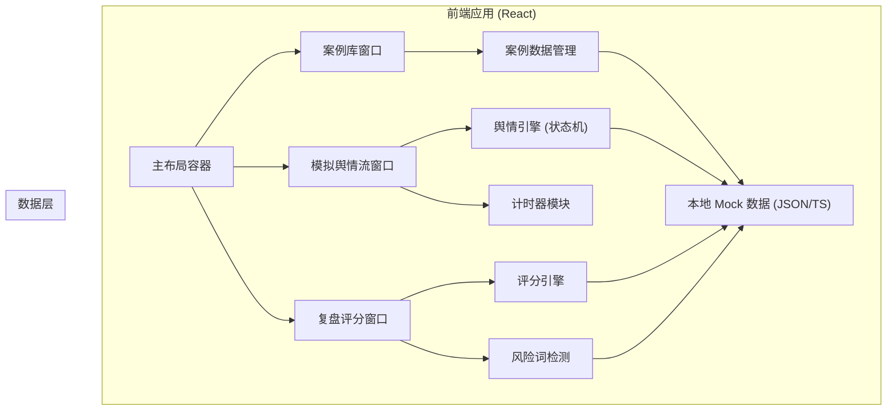

## 1. 架构设计


## 2. 技术描述
- **前端框架**: React@18 + TypeScript
- **构建工具**: Vite@5
- **样式方案**: TailwindCSS@3 (自定义主题配置)
- **状态管理**: React Context + useReducer (全局演练状态)
- **图表库**: recharts (雷达图、热度曲线)
- **图标库**: lucide-react (专业简洁图标)
- **后端**: 无后端，纯前端 Mock 数据驱动
- **数据存储**: 本地状态 + localStorage (保存演练历史)

## 3. 路由定义
| 路由 | 用途 |
|-------|---------|
| / | 主训练工作台（三栏布局，包含全部功能） |

本应用为单页桌面端工具，采用单路由三窗口并排列布局，无需多页面路由。

## 4. 数据模型定义

### 4.1 核心数据类型

```typescript
// 危机场景分类
type CrisisCategory = 'product_quality' | 'safety_incident' | 'employee_speech' | 'supply_chain' | 'other';

// 案例难度
type DifficultyLevel = 'easy' | 'medium' | 'hard' | 'expert';

// 舆情来源类型
type OpinionSource = 'news' | 'social_media' | 'kol' | 'customer_service' | 'media';

// 情绪倾向
type Sentiment = 'positive' | 'neutral' | 'negative';

// 训练参数配置
interface TrainingConfig {
  outbreakSpeed: 1 | 2 | 3 | 4;  // 爆发速度: 1慢-4极快
  mediaAttention: 1 | 2 | 3 | 4; // 媒体关注度: 1低-4极高
  duration: number;              // 演练时长(分钟)
}

// 案例信息
interface CrisisCase {
  id: string;
  title: string;
  category: CrisisCategory;
  summary: string;
  difficulty: DifficultyLevel;
  estimatedDuration: number;
  background: string;
  stakeholders: string[];
  referenceCase?: string;
  opinionStream: OpinionItem[];
  keywords: string[];
  idealResponse: {
    official: string;
    qa: string[];
    internal: string;
  };
}

// 舆情条目
interface OpinionItem {
  id: string;
  source: OpinionSource;
  sourceName: string;
  content: string;
  timestamp: number;  // 相对于演练开始的秒数
  sentiment: Sentiment;
  isScreenshot?: boolean;
  screenshotMeta?: {
    platform: string;
    username: string;
  };
}

// 参训者回应
interface TraineeResponse {
  officialResponse: string;
  qaPoints: string;
  internalNotice: string;
  submittedAt: number;  // 提交时的剩余秒数
}

// 评分维度
interface ScoreDimension {
  name: string;
  score: number;        // 0-100
  maxScore: number;
  deductions: { reason: string; points: number }[];
  suggestions: string[];
}

// 评分结果
interface ReviewResult {
  speed: ScoreDimension;      // 回应速度
  factuality: ScoreDimension; // 事实完整度
  attitude: ScoreDimension;   // 态度温度
  riskWords: ScoreDimension;  // 风险词使用
  totalScore: number;
  riskPhrases: { text: string; suggestion: string; severity: 'high' | 'medium' | 'low' }[];
  comparison: {
    bestScore: number;
    averageScore: number;
    percentile: number;
  };
}

// 全局演练状态
type TrainingPhase = 'idle' | 'configuring' | 'running' | 'submitted' | 'reviewing';

interface TrainingState {
  phase: TrainingPhase;
  selectedCase: CrisisCase | null;
  config: TrainingConfig;
  timeRemaining: number;
  currentOpinions: OpinionItem[];
  response: TraineeResponse;
  reviewResult: ReviewResult | null;
}
```

### 4.2 风险词检测词库
- **推卸责任类**: "不是我们的问题"、"与我司无关"、"消费者使用不当"
- **态度傲慢类**: "无可奉告"、"你们不懂"、"这是行业惯例"
- **承诺过度类**: "绝对安全"、"100%没问题"、"永久保证"
- **模糊表述类**: "可能"、"大概"、"也许"、"尽量"
- **激化矛盾类**: "造谣"、"诽谤"、"将追究法律责任"（未核实前）
