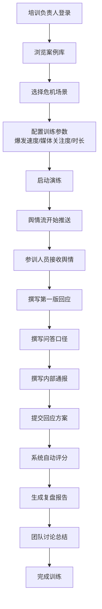

## 1. 产品概述
企业品牌公关危机回应演练工具，帮助公关团队在真实危机前形成统一反应节奏的专业训练平台。
- 面向新入职公关、区域市场负责人和客服主管，提供沉浸式危机模拟训练
- 通过案例演练、实时舆情模拟和智能复盘评分，提升团队危机应对能力

## 2. 核心功能

### 2.1 用户角色
| 角色 | 说明 | 核心权限 |
|------|------|----------|
| 培训负责人 | 组织训练的管理者 | 选择案例、设置训练参数、查看团队成绩 |
| 参训人员 | 参与演练的团队成员 | 接收舆情、撰写回应、参与复盘 |

### 2.2 功能模块
1. **案例库窗口**：场景分类、案例选择、参数配置（爆发速度、媒体关注度）
2. **模拟舆情流窗口**：实时舆情推送、倒计时计时器、回应撰写区（第一版回应/问答口径/内部通报）
3. **复盘评分窗口**：多维度评分（速度/事实/态度/风险词）、二次传播风险提示、历史最佳对比

### 2.3 页面详情
| 页面名称 | 模块名称 | 功能描述 |
|-----------|-------------|---------------------|
| 案例库窗口 | 场景分类导航 | 产品质量、安全事故、员工言论、供应链争议等分类标签 |
| 案例库窗口 | 案例卡片列表 | 展示案例标题、摘要、难度等级、预计时长 |
| 案例库窗口 | 训练参数配置 | 爆发速度滑块（慢/中/快/极快）、媒体关注度（低/中/高/极高）、演练时长设置 |
| 案例库窗口 | 案例详情预览 | 案例背景介绍、关键利益相关方、历史真实案例参考 |
| 模拟舆情流窗口 | 实时舆情信息流 | 瀑布流展示新闻标题、用户质疑、KOL评论、客服截图，带时间戳和来源标识 |
| 模拟舆情流窗口 | 倒计时显示 | 醒目的倒计时器，时间紧迫时视觉警示效果 |
| 模拟舆情流窗口 | 回应撰写面板 | 三个独立编辑区：第一版官方回应、补充问答口径、内部通报要点 |
| 模拟舆情流窗口 | 舆情强度指示器 | 实时显示舆情热度曲线、情绪分布（正面/中性/负面） |
| 复盘评分窗口 | 四维评分雷达图 | 回应速度、事实完整度、态度温度、风险词使用情况的可视化评分 |
| 复盘评分窗口 | 详细评分报告 | 每个维度的得分、扣分项说明、改进建议 |
| 复盘评分窗口 | 风险表述检测 | 高亮标注容易引发二次传播的敏感表述，给出修改建议 |
| 复盘评分窗口 | 优秀回应参考 | 展示同案例的历史最佳回应范例 |

## 3. 核心流程
培训负责人从案例库选择场景并配置训练参数，启动演练后参训人员在模拟舆情流中接收不断刷新的舆情信息，在限定时间内完成三份回应文档的撰写，提交后系统自动进行多维度评分并生成复盘报告，团队可基于评分结果进行讨论总结。

## 4. 用户界面设计
### 4.1 设计风格
- **主色调**：深空蓝 (#1a2744) 作为主背景，搭配警戒红 (#e63946) 作为危机警示色，专业金 (#d4a373) 作为评分高亮色，冷静青 (#2a9d8f) 作为安全操作色
- **按钮风格**：直角微倒角，厚重阴影，按下时有明显凹陷效果，突出专业工具质感
- **字体**：标题使用 Noto Serif SC（专业稳重），正文使用 JetBrains Mono（信息密度高，类似专业终端）
- **布局风格**：三栏式专业工作站布局，类似彭博终端风格，信息密度高，分区明确
- **视觉元素**：数据终端风格的扫描线效果、细微的 CRT 屏幕噪点、单色图标配合像素风格装饰

### 4.2 页面设计概述
| 页面名称 | 模块名称 | UI元素 |
|-----------|-------------|-------------|
| 三栏主布局 | 窗口框架 | 可拖动分隔条、窗口标题栏带状态指示灯、最小化/最大化按钮 |
| 案例库窗口 | 场景分类 | 标签页式导航，选中时有金色高亮边框 |
| 案例库窗口 | 案例卡片 | 深色卡片配淡色边框，悬停时微上浮并显示金色光晕 |
| 案例库窗口 | 参数配置 | 工业风格滑块，带刻度标记和数值显示 |
| 模拟舆情流窗口 | 舆情信息流 | 终端风格滚动列表，不同来源用不同颜色标识，新消息有打字机效果 |
| 模拟舆情流窗口 | 倒计时 | 大号等宽数字字体，最后30秒变红并闪烁 |
| 模拟舆情流窗口 | 撰写面板 | 分区清晰的表单，字数统计实时显示 |
| 复盘评分窗口 | 雷达图 | 深色背景上的金色数据多边形，带网格线和数值标签 |
| 复盘评分窗口 | 风险提示 | 红色警示框，配感叹号图标，高亮风险文字 |

### 4.3 响应式
桌面端优先设计，三栏并排布局（最小支持 1440px 宽度），窗口可独立最大化，支持垂直堆叠模式（窄屏时自动切换）。
